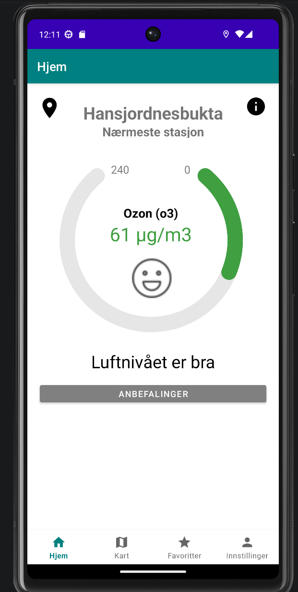
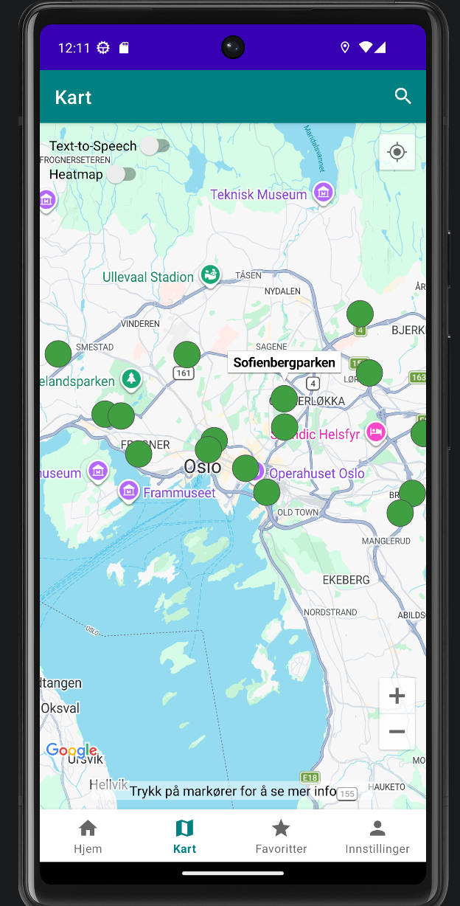
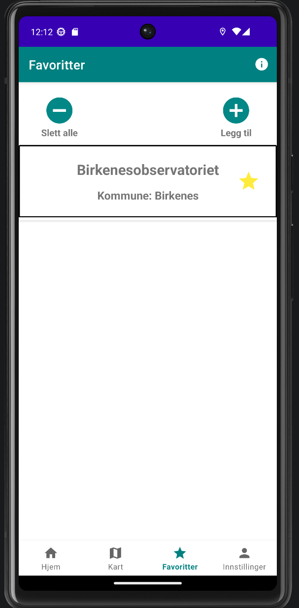

# IN2000-Gruppe-5
Gruppe 5 prosjekt i IN2000. Appen viser luftkvalitet i Norge ved bruk av data fra MET.

## Team Medlemmer:
Birgitte Rygg, Bjørn Vittorio Birkelund-Rospigliosi, Børge Bjørnstadjordet, Elias Eide Skotte, Jonas Longva Pettersen & Rie Nyhus.

---

## Preview
<p align="center">
  
  
  
</p>

---

## Hvordan kjøre prosjektet
Denne appen bruker **Google Maps** og **MET Norway API**.

### 1. API Nøkkel
Du trenger en Google Maps API-nøkkel.
- Lag en fil som heter ``local.properties`` i rot-mappen.
- Legg inn denne linjen:
  ```properties
  MAPS_API_KEY=DIN_NØKKEL_HER
  ```

### 2. Start appen
- Åpne prosjektet i **Android Studio**.
- La Gradle synke ferdig.
- Sett opp virtual android telefon
- Trykk **Run**

## Litt teknisk info
- **Arkitektur:** MVVM (Model-View-ViewModel).
- **Data:** Live air quality data fra api.met.no.
- **Biblioteker:** Google Maps, Fuel (nettverk), GSON, MPAndroidChart, Dexter.
